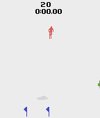

# rl-atari-skiing
Solve [Skiing-v0](https://gym.openai.com/envs/Skiing-v0/) by Using Deep Reinforcement Learning.
The main objective is to solve the ski game in different manners.
It is quite an interesting and hard task because it gives almost rewards at the end of the game.

- [Human Demonstrations](#human-demonstrations)
- [Heuristic Markovian Agent](#heuristic-markovian-agent)
- [DAgger](#dagger)


## Human Demonstrations
Human demonstrations can be utilized for imitation learning, [guiding an agent](https://blog.openai.com/learning-montezumas-revenge-from-a-single-demonstration/) or etc.

Make a dictionary which contains useful info (scores, observations, actions and snapshots) for training.

Output dictionary name would be 'skiing_records'.

Handle the agent by arrow keys.
```
python make_human_data.py
```

Then, restore any state and facilitate it in your own way!
```python
import gym
import numpy as np
import pickle

# load human data and select one timestep
interval = 34
n_replay = 18
with open('./skiing_records', 'rb') as f:
  records = pickle.load(f)
len_records = len(records['observations'])
replay_ids = [0] + [len_records - (i+1) * interval for i in reversed(range(int(np.ceil(len_records/interval))-2))]
replay_id = replay_ids[n_replay]
print(records.keys(), '\n', len(replay_ids), replay_ids)

# make environment
env_name = "Skiing-v0"
env = gym.make(env_name)

# restore state
observe = env.reset()
env.env.restore_full_state(records['snapshots'][replay_id])
observe = records['observations'][replay_id]
score = records['scores'][replay_id]
```

## Heuristic Markovian Agent
As creating human demonstrations is expensive, a heuristic agent, who plays ski not that bad, can be useful to test or guide rl agents. The agent estimates velocity of the player and locations of flags and the player, and uses them to determine which direction is appropriate to go through between the flags. Because it looks only previous and current frames, it is a 2nd-order markovian agent. 



For more information, please check [the jupyter notebook](heuristic_markovian_agent.ipynb).

## DAgger
I implement [DAgger algorithm](https://www.cs.cmu.edu/~sross1/publications/Ross-AIStats11-NoRegret.pdf) in a simplistic way. For simplicity, I get labels from [the heuristic agent](#heuristic-markovian-agent) instead of asking humans to label observations.


For more information, please check [the jupyter notebook](dagger.ipynb).
